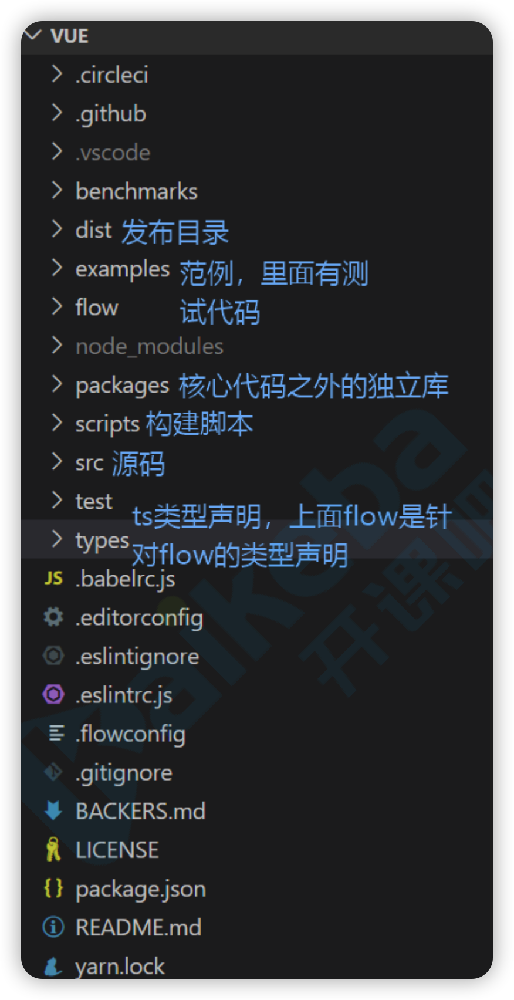

### 目标

1. 源码如何学习
2. Vue初始化
3. 数据响应式


### 学习源码



1. 安装rollup： `npm i -g rollup`

2. 修改dev脚本，添加sourcemap，package.json

   `"dev": "rollup -w -c scripts/config.js --sourcemap --environment TARGET:webfull-dev",`

3. 直接打开`examples/test/01-init.html`，可以进行debug


### 初始化

#### 入口

找到`scripts/config.js`，并搜索`web-full-dev`，可以找到入口文件

```js
'web-full-dev': {
    // 入口
    entry: resolve('web/entry-runtime-with-compiler.js'),
    dest: resolve('dist/vue.js'),
    format: 'umd',
    env: 'development',
    alias: { he: './entity-decoder' },
    banner
  },
```

entry和dist调用了resolve方法

```js
const aliases = require('./alias')
const resolve = p => {
  // web/xxx.js
  // base = web
  const base = p.split('/')[0]
  if (aliases[base]) {
    return path.resolve(aliases[base], p.slice(base.length + 1))
  } else {
    return path.resolve(__dirname, '../', p)
  }
}
```

