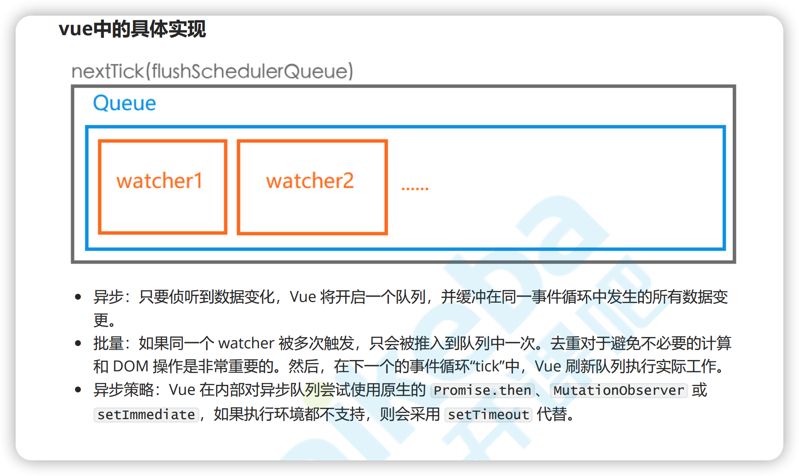
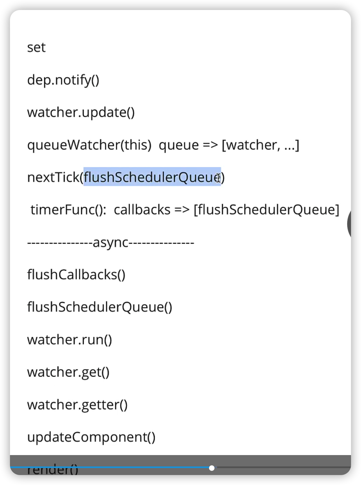

### 具体实现

quene类似洗衣盆，每个watcher都是脏衣服，直到攒够了脏衣服再一起flush冲刷。及组件更新时不必要修改一次更新一次




### 代码解析



`src/core/observer/index.js` set触发`dep.notify()`

```js
Object.defineProperty(obj, key, {
	set: function reactiveSetter (newVal) {
      // 变更通知
      dep.notify()
    }
})
```


`src/core/observer/dep.js`  执行watcher的更新函数

```js
notify () {
    // 循环内部管理所有watcher实例
    // 执行他们的update方法
    for (let i = 0, l = subs.length; i < l; i++) {
      subs[i].update()
    }
  }
}
```


`src/core/observer/watcher.js`  一般走`queueWatcher(this)`

```js
update () {
    /* istanbul ignore else */
    // 只做标记，不会立刻更新，一般是computed
    if (this.lazy) {
      this.dirty = true
    } else if (this.sync) { // 立刻执行$watch({sync: true})
      // watch: {sync:true}
      this.run()
    } else {
      // 正常情况下走这里
      // watcher入队
      queueWatcher(this)
    }
  }
```


`src/core/observer/scheduler.js`  	启动异步任务`nextTick(flushSchedulerQueue)`

```js
// 尝试将传入watcher实例入队
export function queueWatcher (watcher: Watcher) {
  const id = watcher.id
  // 去重, 无论对某个watcher修改多少遍，都是同一个watcher，只有第一次才能入队
  if (has[id] == null) {
    has[id] = true
    if (!flushing) {
      // 入队
      queue.push(watcher)
    } else {
      ...
    }
    // queue the flush
    if (!waiting) {
      waiting = true
      ...
      // 异步启动队列冲刷任务
      // 此处的nextTick就是我们平时使用的那个
      // 启动一个异步任务，在未来的某个时刻执行flushSchedulerQueue
      nextTick(flushSchedulerQueue)
    }
  }
}

```


`src/core/util/next-tick.js` 封装传入的`flushSchedulerQueue`，启动`timerFunc`

```js
export function nextTick (cb?: Function, ctx?: Object) {
  let _resolve
  // 封装一个能够处理错误高阶函数，
  // 不会立刻执行并将它存入callbacks的数组之中
  callbacks.push(() => {
    if (cb) {
      try {
        cb.call(ctx)
      } catch (e) {
        handleError(e, ctx, 'nextTick')
      }
    } else if (_resolve) {
      _resolve(ctx)
    }
  })
  if (!pending) {
    // 异步启动执行
    pending = true
    timerFunc()
  }
 
}
```


`timerFunc`是一个模块级别的函数，如果支持promise则将timerFunc置为promise.then，否则

promise > MutationObserver > setImmediate > setTimeout , 前两种都是微任务，效率更高

```js
let timerFunc

// Promise is available, we will use it:
if (typeof Promise !== 'undefined' && isNative(Promise)) {
  const p = Promise.resolve()
  timerFunc = () => {
    p.then(flushCallbacks)
  }
} else if (!isIE && typeof MutationObserver !== 'undefined' && (
  isNative(MutationObserver) ||
  MutationObserver.toString() === '[object MutationObserverConstructor]'
)) {
  // Use MutationObserver where native Promise is not available,
  timerFunc = () => {
    counter = (counter + 1) % 2
    textNode.data = String(counter)
  }
  isUsingMicroTask = true
} else if (typeof setImmediate !== 'undefined' && isNative(setImmediate)) {
  // Fallback to setImmediate.
  // Technically it leverages the (macro) task queue,  // 从技术上讲，它利用了（宏）任务队列
  // but it is still a better choice than setTimeout.
  timerFunc = () => {
    setImmediate(flushCallbacks)
  }
} else {
  // Fallback to setTimeout.
  timerFunc = () => {
    setTimeout(flushCallbacks, 0)
  }
}
```

------

以下方法已经是异步任务

`flushCallbacks` 做了什么呢?遍历`callbacks`里的方法执行，`callbacks`里的方法是`nextTick`方法里push的封装好的高阶函数

flushCallbacks的执行已经是异步任务，在timerFunc中是以promise.then的方式执行的

```js
const callbacks = []
let pending = false

function flushCallbacks () {
  pending = false
  const copies = callbacks.slice(0)
  callbacks.length = 0
  for (let i = 0; i < copies.length; i++) {
    copies[i]()
  }
}
```


`flushCallbacks`中执行的 `copies[i]()`实际是`nextTick(flushSchedulerQueue)`的`flushSchedulerQueue`

`src/core/observer/scheduler.js`

```js
function flushSchedulerQueue () {
  let watcher, id

  // 遍历所有watchers，执行它们的run函数
  for (index = 0; index < queue.length; index++) {
    watcher = queue[index]
    if (watcher.before) {
      watcher.before()
    }
    id = watcher.id
    has[id] = null
    // 真正更新函数是run
    watcher.run()
  
}
```


`src/core/observer/watcher.js` `watcher.run()`调用了get

```js
 run () {
    if (this.active) {
      // render watcher,render级别的watcher主要是执行get方法
      const value = this.get()
      // user watcher
      // watch/this.$watch('foo', cb)
      // 以下if判断是用户级别的watcher，可以忽略
      if (
        value !== this.value ||
        isObject(value) ||
        this.deep
      ) {
      ...
      }
    }
  }
```


`watcher.get()` 方法调用了getter方法

```js
get () {
    pushTarget(this)
    let value
    const vm = this.vm
    try {
      value = this.getter.call(vm, vm)
    } catch (e) {
  
  }
```


`watcher.getter()`实际是当前组件的对应的更新函数`updateComponent`

```js
export default class Watcher {
	getter: Function;
}
constructor () {
	 if (typeof expOrFn === 'function') {
      // 如果参数2是函数，则表示他是一个组件更新函数
      this.getter = expOrFn
    } 
}

```


`src/core/instance/lifecycle.js` `watcher.getter()`执行的getter方法来自于这里

先执行render得到虚拟dom, 接着update(vnode)，最后patch(oldvnode,vnode)函数diff新旧节点

```js
function mountComponent (): Component {
    // 组件更新函数声明
  let updateComponent
  
  updateComponent = () => {
      // 首先执行render =》 vdom
      vm._update(vm._render(), hydrating)
    }
  
  
  new Watcher(vm, updateComponent, noop, {
    before () {
      if (vm._isMounted && !vm._isDestroyed) {
        callHook(vm, 'beforeUpdate')
      }
    }
  }, true /* isRenderWatcher */)
}
```


### 应用

```js
const app = new Vue({
  el: '#demo',
  data: { foo: 'ready~~' },
  mounted() {            
    this.foo = Math.random()
    console.log('1:' + this.foo);
    this.foo = Math.random()
    console.log('2:' + this.foo);
    this.foo = Math.random()
    console.log('3:' + this.foo);
    // 以上同步代码，还没更新，正在排队
    // 异步行为，此时内容没变
    console.log('p1.innerHTML:' + p1.innerHTML) // ready

    this.$nextTick(() => {
      // 这里才是最新的值
      console.log('p1.innerHTML:' + p1.innerHTML) // 3
    })
  }
});
```

 `this.foo = Math.random()`修改变量实际是向quene队列中push watcher     quene => [watcher...]

第一次排队的时候然后启动nextTick, 启动异步任务

timeFunc：callbacks => [flushSchedulerQueue]

如果手动调用$nextTick，则相当于向callbacks中放函数，callbacks => [flushSchedulerQueue, cb]


```js
this.$nextTick(() => {
  console.log('p1.innerHTML:' + p1.innerHTML) // ready // 用户级nextTick先执行了，watcher队列还没有刷新
})
this.foo = Math.random() // 才会开始触发排队
console.log('1:' + this.foo);
this.foo = Math.random()
console.log('2:' + this.foo);
this.foo = Math.random()
console.log('3:' + this.foo);
console.log('p1.innerHTML:' + p1.innerHTML) // ready
```


```js
this.foo = Math.random()
console.log('1:' + this.foo);
this.foo = Math.random()
console.log('2:' + this.foo);
this.foo = Math.random()
console.log('3:' + this.foo);
// 异步行为，此时内容没变
console.log('p1.innerHTML:' + p1.innerHTML) // ready

Promise.resolve().then(() => {
  // 这里才是最新的值
  console.log('promise:' + p1.innerHTML) // 3
})

this.$nextTick(() => {
  // 这里才是最新的值
  console.log('p1.innerHTML:' + p1.innerHTML) // 3， $nextTick比promise先出现
})
```

flushCallbacks是一个微任务

微任务队列 :[flushCallbacks, promise.then]

this.foo = Math.random()的执行使flushCallbacks先进入了微任务队列

flushCallbacks会执行flushSchedulerQueue，则先清空callbacks里的东西


### nectTick是什么

1. 概念
   1. Vue异步批量更新的策略实际的执行者，利用了事件循环机制，利用异步的方式执行回调函数
   2. 组件更新的时候不会立刻执行，而是通过它异步启动更新，最后就会异步批量更新，提高效率
2. 作用，为什么需要nexttick
   1. nectTick(cb)，数据变化后，当需要访问最新的dom时
3. 如何工作的
   1. 数据变化，watcher先入队，异步冲刷队列，最后调用watcher.run
4. 结合实践 
   1. 数据更新完dom后，获取宽高