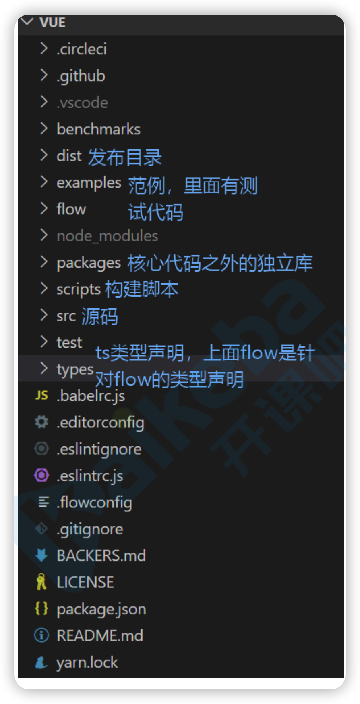
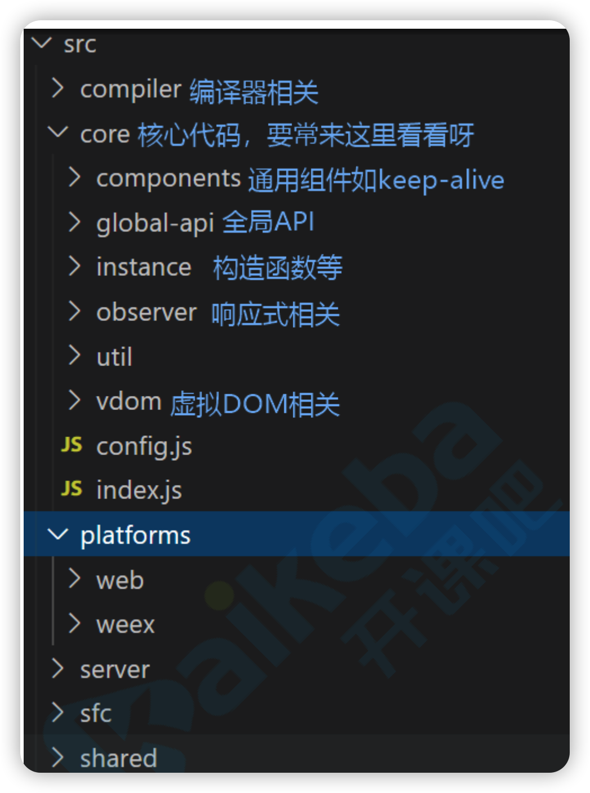

### 目标

1. 源码如何学习
2. Vue初始化
3. 数据响应式


### 学习源码





1. 安装rollup： `npm i -g rollup`

2. 修改dev脚本，添加sourcemap，package.json

   `"dev": "rollup -w -c scripts/config.js --sourcemap --environment TARGET:webfull-dev",`

3. 直接打开`examples/test/01-init.html`，可以进行debug


### 初始化

#### 入口

找到`scripts/config.js`，并搜索`web-full-dev`，可以找到入口文件

```js
'web-full-dev': {
    // 入口
    entry: resolve('web/entry-runtime-with-compiler.js'),
    dest: resolve('dist/vue.js'),
    format: 'umd',
    env: 'development',
    alias: { he: './entity-decoder' },
    banner
  },
```

entry和dist调用了resolve方法，如下

```js
const aliases = require('./alias')
const resolve = p => {
  // web/xxx.js
  // base = web
  const base = p.split('/')[0]
  if (aliases[base]) {
    return path.resolve(aliases[base], p.slice(base.length + 1))
  } else {
    return path.resolve(__dirname, '../', p)
  }
}
```

引入了`scripts/alias.js`文件，都是一些别名，代替真实路径

```js
module.exports = {
  vue: resolve('src/platforms/web/entry-runtime-with-compiler'),
  compiler: resolve('src/compiler'),
  core: resolve('src/core'),
  shared: resolve('src/shared'),
  web: resolve('src/platforms/web'),
  weex: resolve('src/platforms/weex'),
  server: resolve('src/server'),
  sfc: resolve('src/sfc')
}
```

由此，可以找到真实入口`src/platforms/web/entry-runtime-with-compiler.js`


**`src/platforms/web/entry-runtime-with-compiler.js`**

扩展$mount,处理template或el选项,最终处理成render函数

优先级为render>template>el

```js
const mount = Vue.prototype.$mount
Vue.prototype.$mount = function (){
  if (!options.render) {
    if (template) {} else if (el) {}
  }
}
```

接着找到引入Vue的文件


**`src/platforms/web/runtime/index.js`**

1. 安装patch函数，vdom->dom

```js
Vue.prototype.__patch__ = inBrowser ? patch : noop
```

2. 实现$mount方法：调用mountComponent,生成dom并执行挂载

```js
Vue.prototype.$mount = function () {
  el = el && inBrowser ? query(el) : undefined
  return mountComponent(this, el, hydrating)
}
```

再向上找到引入Vue的文件


**`src/core/index.js`**

初始化全局静态API，Vue.set/delete/component/use等

```js
initGlobalAPI(Vue)
// 方法src/core/global-api/index.js
Vue.set = set
Vue.delete = del
Vue.nextTick = nextTick
initUse(Vue) // 实现Vue.use函数
initMixin(Vue) // 实现Vue.mixin函数
initExtend(Vue) // 实现Vue.extend函数
initAssetRegisters(Vue) // 注册实现Vue.component/directive/filter
```

再向上找到引入Vue的文件


**`src/core/instance/index.js`**

Vue构造函数声明

```js
function Vue (options) {
  // 初始化
  this._init(options)
}
```

2. 初始化实例方法和属性

```js
initMixin(Vue) // 实现init函数
stateMixin(Vue) // 状态相关api $data,$props,$set,$delete,$watch
eventsMixin(Vue)// 事件相关api $on,$once,$off,$emit
lifecycleMixin(Vue) // 生命周期api _update,$forceUpdate,$destroy
renderMixin(Vue)// 渲染api _render,$nextTick
```


**`src/core/instance/init.js`**

1. 选项合并，用户选项和默认选项合并

```js
if (options && options._isComponent) {
  initInternalComponent(vm, options)
} else {
  vm.$options = mergeOptions(
    resolveConstructorOptions(vm.constructor),
    options || {},
    vm
  )
}
```

2. 初始化

   ```js
   initLifecycle(vm) // $parent,$root,$children,$refs
   initEvents(vm) // 处理父组件传递的事件和回调
   initRender(vm) // $slots,$scopedSlots,_c,$createElement
   callHook(vm, 'beforeCreate') // 调用生命周期钩子函数
   initInjections(vm) // 获取注入数据
   initState(vm) // 初始化props，methods，data，computed，watch
   initProvide(vm) // 提供数据注入
   callHook(vm, 'created')
   ```

   

初始化流程

1. new Vue()

2. this._init(options)

   1. 合并选项`mergeOptions`

   2. 初始化`vm._self = vm`

      1. `initLifecycle`

         ```js
         // 初始化$parent和$children
         let parent = options.parent
         if (parent && !options.abstract) {
           while (parent.$options.abstract && parent.$parent) {
             parent = parent.$parent
           }
           parent.$children.push(vm)
         }
         ```

      2. `initEvents(vm)`

      3. initRender

         ```js
         // 内部版本，用于编译器生成的那些render函数
         vm._c = (a, b, c, d) => createElement(vm, a, b, c, d, false)
         // 用户编写render函数使用这个
         vm.$createElement = (a, b, c, d) => createElement(vm, a, b, c, d, true)
         
         
         // 对$attrs，$listeners属性进行响应式处理
         if (process.env.NODE_ENV !== 'production') {
             defineReactive(vm, '$attrs', parentData && parentData.attrs || emptyObject, () => {
               !isUpdatingChildComponent && warn(`$attrs is readonly.`, vm)
             }, true)
             defineReactive(vm, '$listeners', options._parentListeners || emptyObject, () => {
               !isUpdatingChildComponent && warn(`$listeners is readonly.`, vm)
             }, true)
           } else {
             defineReactive(vm, '$attrs', parentData && parentData.attrs || emptyObject, null, true)
             defineReactive(vm, '$listeners', options._parentListeners || emptyObject, null, true)
           }
         ```

      4. callHook(vm, 'beforeCreate')

      5. initState,初始化props,methods,computed,watch

         ```js
         function initState (vm: Component) {
           vm._watchers = []
           const opts = vm.$options
           if (opts.props) initProps(vm, opts.props)
           if (opts.methods) initMethods(vm, opts.methods)
           if (opts.data) {
             initData(vm)
           } else {
             observe(vm._data = {}, true /* asRootData */)
           }
           if (opts.computed) initComputed(vm, opts.computed)
           if (opts.watch && opts.watch !== nativeWatch) {
             initWatch(vm, opts.watch)
           }
         }
         ```

      6. initProvide

      7. 如果有el选项，自动挂载

         ```js
         if (vm.$options.el) {
           vm.$mount(vm.$options.el)
         }
         ```

      8. $mount		

         ```js
         // 扩展$mount，最后调用mount方法
         mount.call(this, el, hydrating)
         
         // $mount中调用mountComponent方法
         mountComponent(this, el, hydrating)
         ```

         mountComponent方法中

         1. callHook(vm, 'beforeMount')

         2. 执行_render渲染组件，获取vdom

         3. vm._update(vm._render(), hydrating)，将vdom转换成dom

            ```js
            Vue.prototype._update = function (vnode: VNode, hydrating?: boolean) {
                const vm: Component = this
                const prevEl = vm.$el
                // 上次计算的虚拟dom
                const prevVnode = vm._vnode
                const restoreActiveInstance = setActiveInstance(vm)
                vm._vnode = vnode
                // 初始化时没有prevVnode
                if (!prevVnode) {
                  // initial render
                  // 初始化只走一次
                  vm.$el = vm.__patch__(vm.$el, vnode, hydrating, false /* removeOnly */)
                } else {
                  // updates
                  // diff：因为组件只有一个watcher，内部发生变化的可能有多个值，为了知道具体变化点
                  // 需要做两次vnode之间比对，从而得到不同点，再把这些不同点转换为dom操作，从而做到精准更新
                  vm.$el = vm.__patch__(prevVnode, vnode)
                }
                restoreActiveInstance()
                // update __vue__ reference
                if (prevEl) {
                  prevEl.__vue__ = null
                }
                if (vm.$el) {
                  vm.$el.__vue__ = vm
                }
                // if parent is an HOC, update its $el as well
                if (vm.$vnode && vm.$parent && vm.$vnode === vm.$parent._vnode) {
                  vm.$parent.$el = vm.$el
                }
                // updated hook is called by the scheduler to ensure that children are
                // updated in a parent's updated hook.
              }
            ```

            

   4. new Watcher	

      1. 更新时执行updateComponent，已知上面代码对其进行赋值

         ```
         updateComponent = () => {
         // 首先执行render =》 vdom
         vm._update(vm._render(), hydrating)
         }
         ```

         则再次执行_render()和_update函数

      ```js
      // 执行钩子
      new Watcher(vm, updateComponent, noop, {
          before () {
            if (vm._isMounted && !vm._isDestroyed) {
              callHook(vm, 'beforeUpdate')
            }
          }
        }, true /* isRenderWatcher */)
      
      
      // watcher内部
      if (typeof expOrFn === 'function') {
            // 如果参数2是函数，则表示他是一个组件更新函数
            this.getter = expOrFn
          }
      }
      ```

      

### 响应式处理

**`src/core/instance/state.js`**

```js
function initData (vm: Component) {
  proxy(vm, `_data`, key) // 将data里的数据代理到实例上
  
  // 遍历响应式处理
  observe(data, true /* asRootData */)

}
```


**`src/core/observer/index.js`**

1. observe

   如果做过响应式处理，直接返回`value.__ob__`,否则对对象进行响应式处理

```js
export function observe (value: any, asRootData: ?boolean): Observer | void {
  // Observer作用？
  // 1.将传入value做响应式处理
  let ob: Observer | void
  // 如果已经做过响应式处理，则直接返回ob
  if (hasOwn(value, '__ob__') && value.__ob__ instanceof Observer) {
    ob = value.__ob__
  } else if (
    shouldObserve &&
    !isServerRendering() &&
    (Array.isArray(value) || isPlainObject(value)) &&
    Object.isExtensible(value) &&
    !value._isVue
  ) {
    // 初始化传入需要响应式的对象
    ob = new Observer(value)
  }
 
  return ob
}
```

2. Observer

   1. 每个Observer都对应一个dep
   2. `def(value, '__ob__', this)`将data存到`__ob__`属性里，
   3. 判断对象类型
      1. 不是数组，`walk`遍历属性，进行响应式处理
      2. 是数组，覆盖原型方法，遍历，进行响应式处理

   ```js
   export class Observer {
     value: any;
     dep: Dep;
     vmCount: number; // number of vms that have this object as root $data
   
     constructor (value: any) {
       // 2.此处dep目的？
       // 如果使用Vue.set/delete添加或删除属性，负责通知更新
       this.value = value
       this.dep = new Dep()
       this.vmCount = 0
       def(value, '__ob__', this)
   
       // 1.分辨传入对象类型
       if (Array.isArray(value)) {
         // 现代浏览器，覆盖原型
         if (hasProto) {
           protoAugment(value, arrayMethods)
         } else {
           copyAugment(value, arrayMethods, arrayKeys)
         }
         this.observeArray(value)
       } else {
         this.walk(value)
       }
     }
   
     walk (obj: Object) {
       const keys = Object.keys(obj)
       for (let i = 0; i < keys.length; i++) {
         defineReactive(obj, keys[i])
       }
     }
   
     observeArray (items: Array<any>) {
       for (let i = 0, l = items.length; i < l; i++) {
         observe(items[i])
       }
     }
   
   ```

   

3. defineReactive

   1. new Dep()，创建每个key对应的dep

   2.   `let childOb = !shallow && observe(val)`递归遍历，如果是对象再次调用observe，可以看出每一个对象都会对应一个dep，每一个key也会对应一个dep

   3. 使用defineProperty给属性设置get/set

      ```js
      export function defineReactive (
        obj: Object,
        key: string,
        val: any,
        customSetter?: ?Function,
        shallow?: boolean
      ) {
        // 创建key一一对应的dep
        const dep = new Dep()
      
        const property = Object.getOwnPropertyDescriptor(obj, key)
        if (property && property.configurable === false) {
          return
        }
      
        // cater for pre-defined getter/setters
        const getter = property && property.get
        const setter = property && property.set
        if ((!getter || setter) && arguments.length === 2) {
          val = obj[key]
        }
      
        // 递归遍历
        let childOb = !shallow && observe(val)
        Object.defineProperty(obj, key, {
          enumerable: true,
          configurable: true,
          get: function reactiveGetter () {
            const value = getter ? getter.call(obj) : val
            // 如果存在，说明此次调用触发者是一个Watcher实例
            // dep n：n watcher
            if (Dep.target) {
              // 建立dep和Dep.target之间依赖关系
              dep.depend()
      
              if (childOb) {
                // 建立ob内部dep和Dep.target之间依赖关系
                childOb.dep.depend()
                // 如果是数组，数组内部所有项都要做相同处理
                if (Array.isArray(value)) {
                  dependArray(value)
                }
              }
            }
            return value
          },
          set: function reactiveSetter (newVal) {
            const value = getter ? getter.call(obj) : val
            /* eslint-disable no-self-compare */
            if (newVal === value || (newVal !== newVal && value !== value)) {
              return
            }
            /* eslint-enable no-self-compare */
            if (process.env.NODE_ENV !== 'production' && customSetter) {
              customSetter()
            }
            // #7981: for accessor properties without setter
            if (getter && !setter) return
            if (setter) {
              setter.call(obj, newVal)
            } else {
              val = newVal
            }
            childOb = !shallow && observe(newVal)
            // 变更通知
            dep.notify()
          }
        })
      }
      ```

      