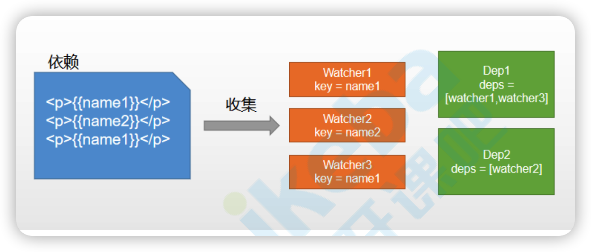

### MVVM



MVVM即model-viewModel-view,viewModel包含数据绑定和事件监听

数据绑定实现了数据变化能够自动渲染到页面，dom监听实现了用户操作页面数据也发生相应的改变

MVC（C即Controller层），是单向渲染，将model数据渲染到view上。MVVM优于MVC是因为ViewModel抽离了Controller层的数据渲染功能，并不是替代，业务逻辑还是放到Controller层实现。因此实现了逻辑和数据渲染之间的解耦，同时解耦了数据和视图


### 三要素
1. 数据响应式，监听数据变化并在视图中更新
2. 模板引擎，描述视图的模板语法
3. 模板渲染，将模板转换成html

### 需求

1. 实现数据响应式

2. 实现观察者，对数据进行遍历，每个属性都进行响应式处理

3. 把data数据代理到实例上，实例可以直接访问数据

4. 模板编译，需要实现update方法，实现视图渲染

5. 依赖收集，实现Watcher和Dep来添加订阅者和通知跟更新


### 数据响应式

利用defineproperty

```js
function defineReactive(obj, key, val) {
    Object.defineProperty(obj, key, {
        set(newval) {
            if (val != newval) {
                console.log('set', newval)
                val = newval  
            }
        },
        get() {
            return val;
        }
    })
}
```


### observe

实现一个observe方法

```js
function observe(obj) {
    // 如果obj不是对象或者为空，则不进行下一层遍历
    if (typeof obj !== 'object' || obj === null) return;
  // 遍历属性，给每一个属性响应式处理
    Object.keys(obj).forEach(key => {
        defineReactive(obj, key, obj[key])
    })
}
```

考虑到数据可能是对象，还需要递归遍历

```js
function observe(obj) {
    // 如果obj不是对象或者为空，则不进行下一层遍历
    if (typeof obj !== 'object' || obj === null) return;
  ...
}
  
  function defineReactive(obj, key, val) {
    // 递归嵌套对象
    observe(val);
   ...
}
```


### 代理

这样Vue实例就可以访问和修改data上的数据

```js
function proxy(vm) {
    Object.keys(vm.$data).forEach(key => {
        defineReactive(vm, key, vm.$data[key])
    })

}
```


### compile

遍历节点，如果有子节点则递归遍历，判断元素类型，分别执行不同方法。元素则获取属性，并执行相应方法；文本节点则获取{{}}中间的内容，将数据渲染在页面上

```js
compile(el) {
  // 获取根节点的子节点
  const childNodes = el.childNodes;
  Array.from(childNodes).map(node => {
    // 是否是元素
    if (this.isELement(node)) {
      // 获取节点属性
      const attrs = node.attributes; 
      Array.from(attrs).forEach(attr => {
        // 是否是指令
        const attrName = attr.name;
        const exp = attr.value;
        // 以k-开头的指令,如k-text
        if (this.isDir(attrName)) {
          // 截取掉k-，获取text
          const dir = attrName.substring(2);
          // 执行方法
          this[dir] && this[dir](exp, node);
        }
        // 以@开头
        if (this.isEvent(attrName)) {
          const dir = attrName.substring(1);
          this.eventHandler(exp, node, dir);
        }

        // 以k-model开头
        if (this.isModel(attrName)) {
          const dir = attrName.substring(1);
          this.modelHandler(exp, node, dir);
        }
      })
      // 递归，遍历子节点
      if (node.childNodes && node.childNodes.length > 0) {
        this.compile(node);
      }
    } else if (this.isText(node)) { // 是否是文本
      // console.log('text', node.textContent)
      this.compileText(node)
    }
  })


}
```

实现指令方法

```js

```

